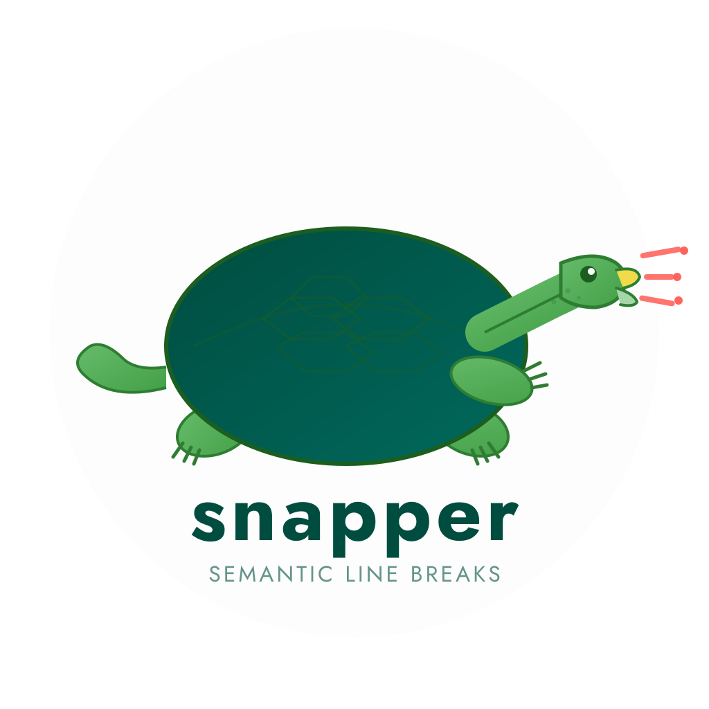

# Table of Contents

-   [About](#about)
    -   [Why?](#why)
    -   [Design](#design)
-   [Installation](#installation)
-   [Usage](#usage)
    -   [Supported formats](#supported-formats)
    -   [Pre-commit hook](#pre-commit-hook)
    -   [Emacs (Apheleia)](#emacs)
    -   [VS Code](#vscode)
    -   [Neovim](#neovim)
    -   [Vim](#vim)
    -   [Git smudge/clean filter](#git-filter)
    -   [Vale integration](#vale)
    -   [Project config](#project-config)
-   [Documentation](#documentation)
-   [Development](#development)
    -   [Key dependencies](#key-dependencies)
    -   [Conventions](#conventions)
-   [License](#license)

# About

A fast, format-aware semantic line break formatter.
Reformats prose so each sentence occupies its own line, producing minimal and meaningful git diffs when collaborating on documents.

## Why?

When multiple authors collaborate on a paper using Git, traditional line wrapping at a fixed column width causes problems.
A single word change can trigger a diff that spans an entire paragraph.
By breaking at sentence boundaries instead, each edit affects only the sentence that changed.

This convention, often called "semantic linefeeds," enjoys longstanding support from technical writers.
Existing tools fall short: latexindent.pl only handles LaTeX, SemBr requires Python and neural networks, and most lack multi-format awareness.
`snapper` solves this as a standalone Rust binary with no runtime dependencies, handling Org-mode, LaTeX, Markdown, and plaintext.

## Design

`snapper` runs a three-stage pipeline:

-   **Parse:** Classify input into prose regions and structure regions
-   **Split:** Detect sentence boundaries in prose regions
-   **Emit:** Output each sentence on its own line

Structure regions (code blocks, math environments, tables, front matter, drawers, comments) pass through unchanged.
Sentence detection relies on Unicode UAX #29 segmentation with abbreviation-aware post-processing that avoids false breaks at titles (Dr., Prof.), references (Fig., Eq.), and Latin terms (e.g., i.e., et al.).

# Installation

Pre-built binary (fastest):

    cargo binstall snapper-fmt

Shell one-liner (Linux/macOS):

    curl -LsSf https://github.com/TurtleTech-ehf/snapper/releases/latest/download/snapper-fmt-installer.sh | sh

Homebrew:

    brew install TurtleTech-ehf/tap/snapper-fmt

pip:

    pip install snapper-fmt

Compile from source:

    cargo install snapper-fmt

Nix:

    nix build github:TurtleTech-ehf/snapper

The crate is `snapper-fmt` on all registries; the binary it installs is `snapper`.

# Usage

Format a file (output to stdout):

    snapper paper.org

Format in place:

    snapper --in-place paper.org

Pipe through stdin (for editor integration):

    cat draft.org | snapper --format org

Check formatting without modifying (for CI):

    snapper --check paper.org paper.tex notes.md

Limit line width (wrap long sentences at word boundaries):

    snapper --max-width 80 paper.org

Preview changes as a unified diff before committing:

    snapper --diff paper.org

Compare two versions at the sentence level (whitespace reflow produces zero diff):

    snapper sdiff paper_v1.org paper_v2.org

Watch files and auto-reformat on save:

    snapper watch '*.org' 'sections/*.tex'

Initialize a project (generates config, pre-commit, gitattributes):

    snapper init

## Supported formats

<table border="2" cellspacing="0" cellpadding="6" rules="groups" frame="hsides">

<colgroup>
<col  class="org-left" />

<col  class="org-left" />

<col  class="org-left" />
</colgroup>
<thead>
<tr>
<th scope="col" class="org-left">Format</th>
<th scope="col" class="org-left">Extensions</th>
<th scope="col" class="org-left">Structure preserved</th>
</tr>
</thead>
<tbody>
<tr>
<td class="org-left">Org-mode</td>
<td class="org-left"><code>.org</code></td>
<td class="org-left">Blocks, drawers, tables, keywords</td>
</tr>

<tr>
<td class="org-left">LaTeX</td>
<td class="org-left"><code>.tex</code>, <code>.latex</code></td>
<td class="org-left">Preamble, math, environments, comments</td>
</tr>

<tr>
<td class="org-left">Markdown</td>
<td class="org-left"><code>.md</code>, <code>.markdown</code></td>
<td class="org-left">Code blocks, front matter, HTML</td>
</tr>

<tr>
<td class="org-left">Plaintext</td>
<td class="org-left">everything else</td>
<td class="org-left">(none; all text treated as prose)</td>
</tr>
</tbody>
</table>

## Pre-commit hook

    - repo: https://github.com/TurtleTech-ehf/snapper
      rev: v0.6.0
      hooks:
        - id: snapper

## Emacs (Apheleia)

    (with-eval-after-load 'apheleia
      (push '(snapper . ("snapper" "--format" "org")) apheleia-formatters)
      (push '(org-mode . snapper) apheleia-mode-alist))

## VS Code

Install [TurtleTech.snapper](https://marketplace.visualstudio.com/items?itemName=TurtleTech.snapper) from the VS Code Marketplace.
The extension uses the built-in LSP server for format-on-save, range formatting, diagnostics, and code actions.

## Neovim

With `lazy.nvim` (rocks support):

    {
      "TurtleTech-ehf/snapper",
      ft = { "org", "tex", "markdown", "rst" },
      config = function()
        vim.opt.runtimepath:append(
          vim.fn.stdpath("data") .. "/lazy/snapper/editors/nvim"
        )
        require("snapper").setup()
      end,
    }

Or with `rocks.nvim`:

    :Rocks install snapper.nvim

## Vim

    Plug 'TurtleTech-ehf/snapper', { 'rtp': 'editors/vim' }

This provides `formatprg` support for automatic formatting with the `gq` operator.

## Git smudge/clean filter

Auto-format on commit, transparent to collaborators:

    git config filter.snapper.clean "snapper --format org"
    git config filter.snapper.smudge cat

Then add to `.gitattributes`:

    *.org filter=snapper

## Vale integration

`snapper` ships a vale style package for editor hints.
Add to your `.vale.ini`:

    StylesPath = /path/to/snapper/vale
    [*.org]
    BasedOnStyles = snapper

For precise CI checks, use `snapper --check` directly.

## Project config

Drop a `.snapperrc.toml` in your project root:

    extra_abbreviations = ["GROMACS", "LAMMPS", "DFT"]
    ignore = ["*.bib", "*.cls"]
    format = "org"
    max_width = 0

`snapper` walks up from the current directory to find it.

# Documentation

Build the docs site with:

    pixi run docbld

# Development

## Key dependencies

-   **Clap 4 (derive):** CLI argument parsing
-   **unicode-segmentation:** UAX #29 sentence boundaries
-   **regex:** Abbreviation and format pattern matching
-   **textwrap:** Optional line width limiting
-   **thiserror:** Typed error handling

## Conventions

We use `cocogitto` via `cog` to handle commit conventions.

### Readme

Construct the `readme` via:

    ./scripts/org_to_md.sh readme_src.org README.md

# License

MIT.

